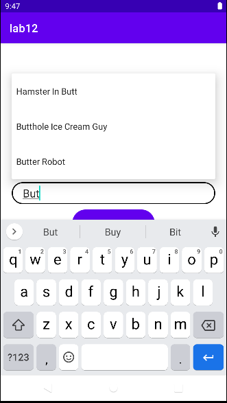
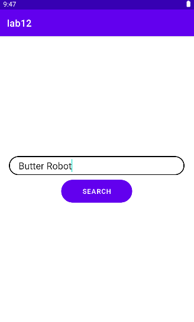
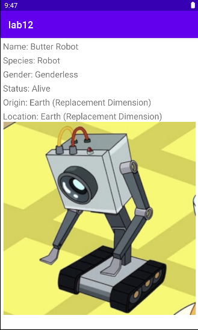

<h2 align="center">  МИНИСТЕРСТВО НАУКИ И ВЫСШЕГО ОБРАЗОВАНИЯ РОССИЙСКОЙ ФЕДЕРАЦИИ ФЕДЕРАЛЬНОЕ ГОСУДАРСТВЕННОЕ БЮДЖЕТНОЕ ОБРАЗОВАТЕЛЬНОЕ УЧРЕЖДЕНИЕ ВЫСШЕГО ОБРАЗОВАНИЯ «САХАЛИНСКИЙ ГОСУДАРСТВЕННЫЙ УНИВЕРСИТЕТ» </h2>
<div align="center">
<h3>Институт естественных наук и техносферной безопасности
<br>
Кафедра информатики
<br>
Половников Владислав Олегович</h3>

<br>
<h3>Лабораторная работа №12
<br>
“Каталог персонажей”
<br>
01.03.02 Прикладная математика и информатика</h3>
<br>
<br>
<br>
<br>
<br>
<br>
<br>
<br>
<br>
<br>
<br>
<br>
<br>
<br>
<h3 align="right">Научный руководитель
<br>
Соболев Евгений Игоревич
</h3>

<h3 align="center">Южно-Сахалинск
<br>
2023г.
</h3>
<hr>
</div>
<p>
Kotlin - это высокоэффективный современный язык программирования, разработанный компанией JetBrains. Он имеет очень чёткий и лаконичный синтаксис, что делает ваш код лёгким для чтения. Kotlin широко используется во всём мире, и его популярность среди разработчиков постоянно растёт. Многие разработчики, использующие Kotlin, отмечают, что это делает их работу быстрее и увлекательнее.
</p>

<h3 align="center">Задание</h3>

Требуется разработать мобильное приложение на Kotlin для поиска информации о персонажах из вселенной Рика и Морти.Нужные вам данные о персонажах можно взять тут.

ФУНКЦИОНАЛЬНЫЕ ТРЕБОВАНИЯ 1:
•		Экран с поисковой строкой;
•		Отображение информации о персонаже (имя, раса, пол, статус);
•		Вся информация о персонажах задаётся внутри программы.
Может пригодиться: пример организации данных.

ФУНКЦИОНАЛЬНЫЕ ТРЕБОВАНИЯ 2:
•		Отдельный экран с информацией о персонаже;
•		Отображение расширенной информации о персонаже (изображение, родная планета, местоположение).
•	Вся информация о персонажах задается внутри программы.

ФУНКЦИОНАЛЬНЫЕ ТРЕБОВАНИЯ 3:
•		Использовать RickAndMortyAPI для поддержания актуальности информации о персонажах.


<h1 align="center">Решение</h2>







<h2 align="center">MainActivity</h2>

```kotlin
package com.example.lab12

import androidx.appcompat.app.AppCompatActivity
import android.os.Bundle
import android.util.Log

interface JsonDownloadCallback {
    fun onJsonDownloadComplete(result: Boolean)
}

class MainActivity : AppCompatActivity(), JsonDownloadCallback {

    override fun onCreate(savedInstanceState: Bundle?) {
        super.onCreate(savedInstanceState)
        setContentView(R.layout.activity_main)

        val jsonDownloader = JsonDownloader(this@MainActivity, this)
        jsonDownloader.downloadJsonFile("https://rickandmortyapi.com/api/character")
    }

    override fun onJsonDownloadComplete(result: Boolean) {
        val jsonReader = JsonReader(this@MainActivity)
        if(jsonReader != null) {
            DataCharacters = jsonReader.readCharacterData()
            val characters = DataCharacters
            if (characters != null) {
                Log.d("Tag1", characters.size.toString())
            }
        }
            supportFragmentManager.beginTransaction()
                .replace(R.id.container, MainFragment.newInstance())
                .commitNow()
    }

}
```

<h2 align="center">MainFragment</h2>

```kotlin
package com.example.lab12


import android.os.Bundle
import androidx.fragment.app.Fragment
import android.view.LayoutInflater
import android.view.View
import android.view.ViewGroup
import android.widget.ArrayAdapter
import android.widget.AutoCompleteTextView
import android.widget.Button

class MainFragment : Fragment() {

    private lateinit var searchEditText: AutoCompleteTextView
    private lateinit var searchButton: Button

    companion object {
        fun newInstance() = MainFragment()
    }


    override fun onCreate(savedInstanceState: Bundle?) {
        super.onCreate(savedInstanceState)
    }

    override fun onCreateView(
        inflater: LayoutInflater, container: ViewGroup?,
        savedInstanceState: Bundle?
    ): View {
        val view = inflater.inflate(R.layout.fragment_main, container, false)
        searchEditText = view.findViewById(R.id.search_character) as AutoCompleteTextView
        searchButton = view.findViewById(R.id.button_search) as Button
        var NamesList: Array<String>? = null
        val dataCharacters = DataCharacters
        if (dataCharacters != null) {
            NamesList = dataCharacters.map { it.name }.toTypedArray()
        }

        var adapter: ArrayAdapter<String>? = null
        if (NamesList != null) {
            adapter = ArrayAdapter(
                requireContext(),
                android.R.layout.simple_dropdown_item_1line,
                NamesList)
            searchEditText.setAdapter(adapter)
        }

        searchButton.setOnClickListener {
            val inputData = searchEditText.text.toString()

            val characterFragment = CharacterFragment()
            val bundle = Bundle()
            bundle.putString("Character_name", inputData)
            characterFragment.arguments = bundle

            val fragmentManager = requireActivity().supportFragmentManager
            fragmentManager.beginTransaction()
                .replace(R.id.container, characterFragment)
                .addToBackStack(null)
                .commit()
        }
        return view
    }

}
```

<h2 align="center">Character</h2>

```kotlin
package com.example.lab12

data class Character(val id: Int,
                     val name: String,
                     val species: String,
                     val gender: String,
                     val status: String,
                     val image: String,
                     val origin: String,
                     var location: String)

var DataCharacters: List<com.example.lab12.Character>? = null
```

<h2 align="center">CharacterFragment</h2>

```kotlin
package com.example.lab12

import android.os.Bundle
import android.view.LayoutInflater
import android.view.View
import android.view.ViewGroup
import android.widget.ImageView
import android.widget.TextView
import androidx.fragment.app.Fragment
import com.bumptech.glide.Glide

class CharacterFragment: Fragment() {

    private lateinit var nameText: TextView
    private lateinit var speciesText: TextView
    private lateinit var genderText: TextView
    private lateinit var statusText: TextView
    private lateinit var originText: TextView
    private lateinit var locationText: TextView
    private lateinit var imageCharacter: ImageView


    override fun onCreate(savedInstanceState: Bundle?) {
        super.onCreate(savedInstanceState)

    }

    override fun onCreateView(
        inflater: LayoutInflater, container: ViewGroup?,
        savedInstanceState: Bundle?
    ): View {
        val view = inflater.inflate(R.layout.fragment_character, container, false)
        val characterName = arguments?.getString("Character_name")
        nameText = view.findViewById(R.id.textView_name) as TextView
        speciesText = view.findViewById(R.id.textView_species) as TextView
        genderText = view.findViewById(R.id.textView_gender) as TextView
        statusText = view.findViewById(R.id.textView_status) as TextView
        originText = view.findViewById(R.id.textView_origin) as TextView
        locationText = view.findViewById(R.id.textView_location) as TextView
        imageCharacter = view.findViewById(R.id.image_character) as ImageView

        val character = DataCharacters?.find { it.name.equals(characterName, ignoreCase = true) }

        nameText.text = character?.name
        speciesText.text = character?.species
        genderText.text = character?.gender
        statusText.text = character?.status
        originText.text = character?.origin
        locationText.text = character?.location
        Glide.with(this).load(character?.image).into(imageCharacter)
        return view
    }
}
```

<h2 align="center">JsonReader</h2>

```kotlin
package com.example.lab12

import android.content.Context
import android.util.Log
import org.json.JSONObject
import java.io.BufferedReader
import java.io.InputStreamReader

class JsonReader(private val context: Context) {
    private val TAG = "JsonReader"

    fun readCharacterData(): List<Character>? {
        try {
            val inputStream = context.openFileInput("character.json")
            val bufferedReader = BufferedReader(InputStreamReader(inputStream))
            val stringBuilder = StringBuilder()
            var line: String?

            while (bufferedReader.readLine().also { line = it } != null) {
                stringBuilder.append(line)
            }

            val json = JSONObject(stringBuilder.toString())
            val results = json.getJSONArray("results")
            val characterList = mutableListOf<Character>()

            for (i in 0 until results.length()) {
                val character = results.getJSONObject(i)
                val id = character.getInt("id")
                val name = character.getString("name")
                val species = character.getString("species")
                val gender = character.getString("gender")
                val status = character.getString("status")
                val image = character.getString("image")
                val origin = character.getJSONObject("origin").getString("name")
                val location = character.getJSONObject("location").getString("name")
                val characterObj = Character(id, name, species, gender, status, image, origin, location)
                characterList.add(characterObj)
            }

            return characterList
        } catch (e: Exception) {
            Log.e(TAG, "Error reading JSON file: ${e.message}")
            return null
        }
    }
}
```

<h2 align="center">JsonDownloader</h2>

```kotlin
package com.example.lab12

import android.content.Context
import android.os.AsyncTask
import android.util.Log
import org.json.JSONObject
import java.io.BufferedInputStream
import java.io.FileOutputStream
import java.io.InputStream
import java.net.HttpURLConnection
import java.net.URL

class JsonDownloader(private val context: Context, private val callback: JsonDownloadCallback) {

    private val TAG = "JsonDownloader"

    private val jsonBuilder = StringBuilder()

    fun downloadJsonFile(url: String) {
        JsonDownloadTask().execute(url)
    }

    private inner class JsonDownloadTask : AsyncTask<String, Void, Boolean>() {

        override fun doInBackground(vararg urls: String): Boolean {
            val url = URL(urls[0])
            var connection: HttpURLConnection? = null
            var inputStream: InputStream? = null
            var fileOutputStream: FileOutputStream? = null

            try {
                val file = context.getFileStreamPath("character.json")
                if (file.exists()) {
                    file.delete()
                }

                var nextPageUrl = url.toString()

                while (nextPageUrl.isNotEmpty()) {
                    connection = URL(nextPageUrl).openConnection() as HttpURLConnection
                    connection.connect()

                    if (connection.responseCode != HttpURLConnection.HTTP_OK) {
                        Log.e(TAG, "Server returned HTTP ${connection.responseCode}")
                        return false
                    }

                    fileOutputStream = FileOutputStream(file, true)
                    inputStream = BufferedInputStream(connection.inputStream)

                    val buffer = ByteArray(1024)
                    var bytesRead: Int

                    while (inputStream.read(buffer).also { bytesRead = it } != -1) {
                        fileOutputStream.write(buffer, 0, bytesRead)
                        jsonBuilder.append(String(buffer, 0, bytesRead, Charsets.UTF_8))
                    }

                    val jsonData = jsonBuilder.toString()
                    val jsonObject = JSONObject(jsonData)

                    val resultsArray = jsonObject.getJSONArray("results")

                    val existingData = JSONObject(file.readText())
                    val existingResultsArray = existingData.getJSONArray("results")

                    for (i in 0 until resultsArray.length()) {
                        val result = resultsArray.getJSONObject(i)
                        existingResultsArray.put(result)
                    }

                    fileOutputStream.close()
                    fileOutputStream = FileOutputStream(file, false)
                    fileOutputStream.write(existingData.toString().toByteArray())

                    nextPageUrl = getNextPageUrl(jsonData)
                    jsonBuilder.clear()

                    connection.disconnect()
                    inputStream.close()
                    fileOutputStream.close()
                }

                return true
            } catch (e: Exception) {
                Log.e(TAG, "Error downloading JSON file: ${e.message}")
                return false
            } finally {
                connection?.disconnect()
                inputStream?.close()
                fileOutputStream?.close()
            }
        }

        override fun onPostExecute(result: Boolean) {
            if (result) {
                Log.d(TAG, "JSON file downloaded successfully")
                callback.onJsonDownloadComplete(result)
            } else {
                Log.d(TAG, "Failed to download JSON file")
                callback.onJsonDownloadComplete(result)
            }
        }

        private fun getNextPageUrl(jsonData: String): String {
            val json = JSONObject(jsonData)
            val info = json.optJSONObject("info")
            return info?.optString("next", "") ?: ""
        }
    }
}
```


<h2 align="center">activity_main</h2>

```kotlin
<?xml version="1.0" encoding="utf-8"?>
<FrameLayout xmlns:android="http://schemas.android.com/apk/res/android"
    xmlns:tools="http://schemas.android.com/tools"
    android:id="@+id/container"
    android:layout_width="match_parent"
    android:layout_height="match_parent"
    tools:context=".MainActivity" />
```

<h2 align="center">fragment_main</h2>

```kotlin
<?xml version="1.0" encoding="utf-8"?>
<androidx.constraintlayout.widget.ConstraintLayout xmlns:android="http://schemas.android.com/apk/res/android"
    xmlns:app="http://schemas.android.com/apk/res-auto"
    xmlns:tools="http://schemas.android.com/tools"
    android:id="@+id/main"
    android:layout_width="match_parent"
    android:layout_height="match_parent"
    tools:context=".MainFragment">

    <LinearLayout
        android:layout_width="match_parent"
        android:layout_height="wrap_content"
        android:orientation="vertical"
        android:gravity="center_horizontal"
        app:layout_constraintBottom_toBottomOf="parent"
        app:layout_constraintEnd_toEndOf="parent"
        app:layout_constraintStart_toStartOf="parent"
        app:layout_constraintTop_toTopOf="parent">

        <AutoCompleteTextView
            android:id="@+id/search_character"
            android:layout_width="match_parent"
            android:layout_height="40dp"
            android:textSize="20dp"
            android:layout_marginHorizontal="20dp"
            android:paddingHorizontal="20dp"
            android:background="@drawable/rounded"
            android:hint="Write a name of character" />

        <Button
            android:id="@+id/button_search"
            android:layout_width="150dp"
            android:layout_marginTop="10dp"
            android:layout_height="wrap_content"
            android:text="Search"
            android:background="@drawable/rounded"/>


    </LinearLayout>

</androidx.constraintlayout.widget.ConstraintLayout>
```

<h2 align="center">fragment_character</h2>

```kotlin
<?xml version="1.0" encoding="utf-8"?>
<androidx.constraintlayout.widget.ConstraintLayout xmlns:android="http://schemas.android.com/apk/res/android"
    xmlns:app="http://schemas.android.com/apk/res-auto"
    xmlns:tools="http://schemas.android.com/tools"
    android:layout_width="match_parent"
    android:layout_height="match_parent">

    <LinearLayout
        android:id="@+id/layout_name"
        android:layout_width="wrap_content"
        android:layout_height="wrap_content"
        android:layout_marginTop="5dp"
        android:layout_marginLeft="5dp"
        android:orientation="horizontal"
        app:layout_constraintStart_toStartOf="parent"
        app:layout_constraintTop_toTopOf="parent">

        <TextView
            android:id="@+id/label_name"
            android:layout_width="wrap_content"
            android:layout_height="wrap_content"
            android:layout_weight="1"
            android:textSize="18dp"
            android:text="Name: " />

        <TextView
            android:id="@+id/textView_name"
            android:layout_width="wrap_content"
            android:textSize="18dp"
            android:layout_height="wrap_content"
            android:layout_weight="1"

            android:text="name" />
    </LinearLayout>

    <LinearLayout
        android:id="@+id/layout_species"
        android:layout_width="wrap_content"
        android:layout_height="wrap_content"
        android:layout_marginTop="5dp"
        android:layout_marginLeft="5dp"
        android:orientation="horizontal"
        app:layout_constraintStart_toStartOf="parent"
        app:layout_constraintTop_toBottomOf="@id/layout_name">

        <TextView
            android:id="@+id/label_species"
            android:layout_width="wrap_content"
            android:layout_height="wrap_content"
            android:layout_weight="1"
            android:textSize="18dp"
            android:text="Species: " />

        <TextView
            android:id="@+id/textView_species"
            android:layout_width="wrap_content"
            android:textSize="18dp"
            android:layout_height="wrap_content"
            android:layout_weight="1"
            android:text="species" />
    </LinearLayout>

    <LinearLayout
        android:id="@+id/layout_gender"
        android:layout_width="wrap_content"
        android:layout_height="wrap_content"
        android:layout_marginTop="5dp"
        android:layout_marginLeft="5dp"
        android:orientation="horizontal"
        app:layout_constraintStart_toStartOf="parent"
        app:layout_constraintTop_toBottomOf="@id/layout_species">

        <TextView
            android:id="@+id/label_gender"
            android:layout_width="wrap_content"
            android:layout_height="wrap_content"
            android:layout_weight="1"
            android:textSize="18dp"
            android:text="Gender: " />

        <TextView
            android:id="@+id/textView_gender"
            android:layout_width="wrap_content"
            android:textSize="18dp"
            android:layout_height="wrap_content"
            android:layout_weight="1"
            android:text="gender" />
    </LinearLayout>

    <LinearLayout
        android:id="@+id/layout_status"
        android:layout_width="wrap_content"
        android:layout_height="wrap_content"
        android:layout_marginTop="5dp"
        android:layout_marginLeft="5dp"
        android:orientation="horizontal"
        app:layout_constraintStart_toStartOf="parent"
        app:layout_constraintTop_toBottomOf="@id/layout_gender">

        <TextView
            android:id="@+id/label_status"
            android:layout_width="wrap_content"
            android:layout_height="wrap_content"
            android:layout_weight="1"
            android:textSize="18dp"
            android:text="Status: " />

        <TextView
            android:id="@+id/textView_status"
            android:layout_width="wrap_content"
            android:textSize="18dp"
            android:layout_height="wrap_content"
            android:layout_weight="1"
            android:text="status" />
    </LinearLayout>

    <LinearLayout
        android:id="@+id/layout_origin"
        android:layout_width="wrap_content"
        android:layout_height="wrap_content"
        android:layout_marginTop="5dp"
        android:layout_marginLeft="5dp"
        android:orientation="horizontal"
        app:layout_constraintStart_toStartOf="parent"
        app:layout_constraintTop_toBottomOf="@id/layout_status">

        <TextView
            android:id="@+id/label_origin"
            android:layout_width="wrap_content"
            android:layout_height="wrap_content"
            android:layout_weight="1"
            android:textSize="18dp"
            android:text="Origin: " />

        <TextView
            android:id="@+id/textView_origin"
            android:layout_width="wrap_content"
            android:textSize="18dp"
            android:layout_height="wrap_content"
            android:layout_weight="1"
            android:text="origin" />
    </LinearLayout>

    <LinearLayout
        android:id="@+id/layout_location"
        android:layout_width="wrap_content"
        android:layout_height="wrap_content"
        android:layout_marginTop="5dp"
        android:layout_marginLeft="5dp"
        android:orientation="horizontal"
        app:layout_constraintStart_toStartOf="parent"
        app:layout_constraintTop_toBottomOf="@id/layout_origin">

        <TextView
            android:id="@+id/label_location"
            android:layout_width="wrap_content"
            android:layout_height="wrap_content"
            android:layout_weight="1"
            android:textSize="18dp"
            android:text="Location: " />

        <TextView
            android:id="@+id/textView_location"
            android:layout_width="wrap_content"
            android:textSize="18dp"
            android:layout_height="wrap_content"
            android:layout_weight="1"
            android:text="location" />
    </LinearLayout>

    <ImageView
        android:id="@+id/image_character"
        android:layout_width="400dp"
        android:layout_height="400dp"
        app:layout_constraintEnd_toEndOf="parent"
        app:layout_constraintStart_toStartOf="parent"
        app:layout_constraintTop_toBottomOf="@+id/layout_location"
        tools:srcCompat="@tools:sample/avatars" />


</androidx.constraintlayout.widget.ConstraintLayout>
```

<h2 align="center">Вывод</h2>
Я научился создавать приложение на основе RickAndMortyAPI